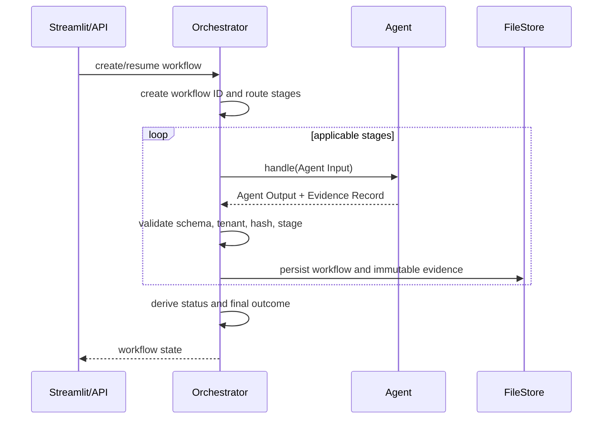

# CUBE Recovery Manager Architecture

This document describes the implemented Round 3 Recovery Manager, not the
starter template.

## 1. Component diagram

```text
                Streamlit UI
                     |
                     v
              Orchestrator
                     |
    +----------------+----------------+
    |        |        |        |       |
    v        v        v        v       v
Receiving   Prep    Pack   Returns  Recovery
    |        |        |        |       |
    +--------+--------+--------+-------+
                     |
                     v
              Evidence Store
                     |
                     v
              Final Outcome
```

The Streamlit UI and FastAPI API are two front doors to the same orchestrator.
Neither front door calls an agent directly.



## 2. Workflow creation and IDs

`POST /workflows` or the Streamlit Start Workflow action supplies
`org_id`, `unit_id`/`subject_id`, route, return state, and optional case
context. The orchestrator creates a stable ID:

```text
WF-<org_id>-<unit_id>
```

Repeated requests for the same workflow reuse persisted state rather than
creating a second workflow.

## 3. Agent sequencing and manifests

The flow in `orchestration/flow.json` routes:

```text
Receiving -> Prep for FBA
           -> Pack for MFN
           -> Returns when returned=true
           -> Recovery
```

Each stage is discovered from `agents/<stage>/agent.json`, which declares its
stage, agent ID, mode, module, URL, and implementation notes. Each current
Python agent exposes:

```python
handle(request: dict) -> dict
```

The orchestrator can use the in-process client or the HTTP client, depending
on `ORCH_MODE` and the manifest.

## 4. Evidence propagation and validation

Every later stage receives:

- Original workflow and subject identifiers
- Stage-specific discovered inputs
- All earlier evidence records
- Current workflow overrides
- Case context

Before accepting an output, the orchestrator validates the agent-output and
evidence schemas, stage, workflow ID, organization/subject tenancy, output and
evidence consistency, and content hash.

Evidence records contain checks, verdicts, confidence, model metadata,
timestamps, inputs, upstream references, and content hashes. `FileStore`
persists evidence by record ID and rejects a different body for an existing
record ID. This preserves the audit trail without pretending that a hash alone
is tamper-proof.

## 5. Missing evidence and contradictions

Missing visual or upstream evidence is represented as `pending`, `error`, or
`UNCERTAIN`; it is never turned into `PASS`. Recovery treats unsupported
charges as `SILENT` and records why they cannot be claimed.

Contradictions are retained explicitly through charge positions, source record
IDs, check details, and final-outcome reasoning. Human overrides are separate
append-only entries and do not rewrite the original evidence record.

## 6. Retry, timeout, failure, and resume behavior

Transient `AgentTimeout` and `AgentUnavailable` failures are retried according
to flow defaults. Connection failures are distinguished from response
timeouts. Refusals, invalid output, tenant mismatches, and unexpected agent
exceptions are recorded as non-success failures.

Each stage records runs, latest attempts, timestamps, duration, error details,
and evidence status. `POST /workflows/{id}/resume` clears the halt and retries
failed or incomplete stages while retaining earlier evidence and failed
attempt records.

No exception path returns a success-shaped result.

## 7. Human overrides

`POST /workflows/{id}/overrides` records the actor, reason, original verdict,
previous effective verdict, new verdict, and superseded record ID. The
orchestrator recalculates the final outcome from the effective verdict while
preserving the original agent result.

## 8. Tenant and organization validation

`org_id`, `subject_id`, and `workflow_id` are carried through every request,
record, and persisted workflow. Agents scope sample/capture lookups to the
organization and reject unknown subjects. The orchestrator rejects output
about another organization or subject. The persistence layer uses workflow
and evidence IDs, and must be placed behind tenant authorization in a
multi-user deployment.

The current FastAPI API has no authentication or authorization. It must not be
publicly exposed until those controls are added.

## 9. Durable FileStore

The existing `orchestration.store.FileStore` writes:

```text
out/workflows/<workflow_id>.json
out/evidence/<record_id>.json
```

Writes use temporary files and atomic replacement for workflow state. The
Streamlit UI uses this store rather than relying only on session state, so
reruns and process restarts retain workflow state, evidence, errors, and
overrides.

## 10. Final outcome derivation

`orchestration.rollup` derives status and outcome from stored evidence and
overrides. It distinguishes:

- `CLEAN`
- `CLAIM_RECOMMENDED`
- `EXCEPTION`
- `NEEDS_REVIEW`
- `INCOMPLETE`

Workflow statuses distinguish completed, failed, blocked, recovery-required,
and in-progress conditions. Recovery informs the evidence chain; the
orchestrator remains the authority that derives the consolidated final
outcome.

## 11. AI and fallback paths

The existing agents retain their real implementations. Some have optional
live model paths and labelled local fallback/replay paths:

- Missing Prep visual evidence yields honest `UNCERTAIN`.
- Pack may use CSV replay when no images are supplied.
- Returns may use labelled CSV replay only when no photos are supplied.
- Receiving and Recovery have deterministic local paths when no model key is
  configured.

Fallback data is synthetic or operator-provided test data, not real-world
evidence. The live-only dependencies are listed in
`requirements-live.txt`; the core requirements remain sufficient for the
default application and tests.

## 12. API and Streamlit separation

The FastAPI application in `orchestration/api.py` exposes:

```text
GET  /health
POST /workflows
GET  /workflows/{id}
GET  /workflows/{id}/evidence
POST /workflows/{id}/resume
POST /workflows/{id}/overrides
```

`app.py` is the sole Streamlit entry point. It renders workflow state and
calls orchestrator functions for creation, resume, and overrides. It does not
sequence agents, construct evidence, or derive outcomes itself.
